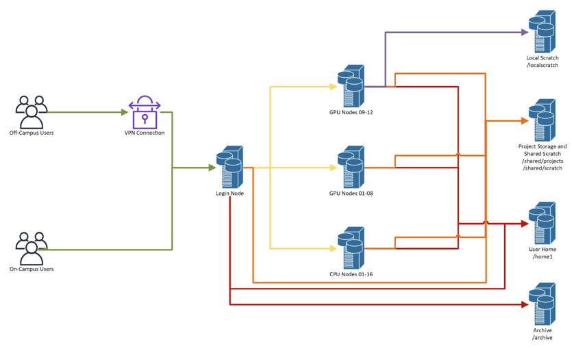

# 1. Cluster Architecture & Storage Types

AI.Panther is a high-performance computing (HPC) cluster at Florida Tech. It is **not a single computer** — it is a collection of interconnected nodes managed by a job scheduler.

## How access works

- **Off-campus users** connect through a VPN connection, then SSH into the **Login Node**.
- **On-campus users** SSH directly into the **Login Node**.
- From the Login Node, **Slurm** dispatches your jobs to the appropriate compute nodes.

## Compute nodes

| Node Group | Nodes |
|---|---|
| GPU Nodes 09–12 (H200) | 4 nodes |
| GPU Nodes 01–08 (A100) | 8 nodes |
| CPU Nodes 01–16 | 16 nodes |

## Storage & where it's mounted

| Storage | Path | Mount Type | Accessible From |
|---|---|---|---|
| User Home | `/home1` | NFS Mount | Login Node, all GPU nodes, all CPU nodes |
| Project Storage | `/shared/projects` | LFS Mount (DDN Servers) | Login Node, all GPU nodes, all CPU nodes |
| Shared Scratch | `/shared/scratch` | LFS Mount (DDN Servers) | Login Node, all GPU nodes, all CPU nodes |
| Local Scratch | `/localscratch` | Local Mount | GPU Nodes 09–12 (H200) only |
| Archive | `/archive` | NFS Mount | Login Node, CPU nodes |

## Storage details

| Path | Type | Description | Lifecycle |
|---|---|---|---|
| `/home1` | Network Home Directories | User home directories, configs, scripts (all users) | Persistent |
| `/localscratch` | Local Scratch | Temporary, high-churn, node-local (all users, H200 nodes) | Auto-purged |
| `/shared/projects` | Project Storage | Shared research project data (requires project approval) | Time-limited |
| `/shared/scratch` | Shared Scratch | Temporary, high-churn, across nodes (all users) | Auto-purged |

> **Key takeaway:** The Login Node is for **light tasks** (editing files, submitting jobs). Compute nodes handle your actual workloads. **Running heavy processes on the Login Node is prohibited.**

## Where this is going

The sections that follow build towards one thing. By [Section 9](09-detection-demo.md) you will
have a job running on a GPU node, a notebook open in your own browser, and a model drawing boxes
around traffic on a live camera pointed at Babcock Street. Everything before that is the machinery
needed to get there: logging in, finding your way around the file system, moving files, asking
Slurm for hardware, and setting up Python.

## References

- KB Article: [What is the AI.Panther cluster?](https://help.fit.edu/TDClient/39/Portal/KB/ArticleDet?ID=2831)
- KB Article: [AI.Panther Storage Types](https://help.fit.edu/TDClient/39/Portal/KB/ArticleDet?ID=20725)

---

**Next →** [Section 2: SSH & Connecting](02-ssh-connecting.md)
