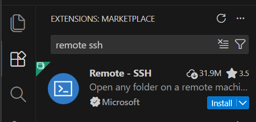
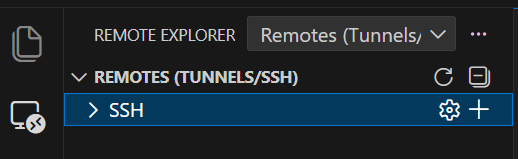
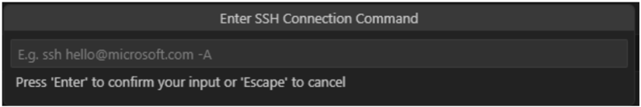
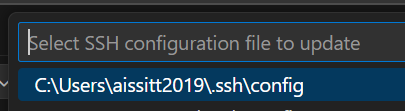

# 5. VS Code SSH Setup

Visual Studio Code can connect directly to AI.Panther, giving you a full editor, file browser, and integrated terminal on the cluster.

## 5.1 Install the Remote-SSH extension

Open Visual Studio Code. Click the **Extensions** icon in the left sidebar (or press `Ctrl+Shift+X`). Search for **"Remote - SSH"** and install the extension by Microsoft.



## 5.2 Open the Remote Explorer

After installing the extension, a new **Remote Explorer** icon will appear in the left sidebar. Click it, then make sure the dropdown at the top is set to **Remotes (Tunnels/SSH)**.



## 5.3 Add a new SSH connection

In the Remote Explorer panel, expand **SSH** and click the **+** (plus) button to add a new remote. When prompted to enter an SSH connection command, type:

```bash
ssh username@ai-panther.fit.edu
```

Replace `username` with your Florida Tech TRACKS username.



## 5.4 Select the SSH configuration file

When prompted to select an SSH configuration file, choose the default option (typically `C:\Users\username\.ssh\config` on Windows or `~/.ssh/config` on macOS/Linux).



## 5.5 Connect to AI.Panther

The `ai-panther.fit.edu` host should now appear under **SSH** in the Remote Explorer. Expand it and click **Connect in Current Window** or **Connect in New Window** next to your username entry. If prompted for the host operating system, select **Linux**. Enter your TRACKS password when prompted.

> **Note:** On your first connection, you may see a message stating that the authenticity of the host can't be established. This is normal — type `yes` and press Enter to continue.

## 5.6 Open your home directory

Once connected, go to **File → Open Folder** and enter the path to your home directory:

```text
/home1/username
```

Click **OK**. You now have full file explorer access to your files on AI.Panther.

## Troubleshooting

| Problem | Fix |
|---|---|
| **Connection timed out** | Make sure FortiClient VPN is connected if you are off campus. |
| **Permission denied** | Double-check your TRACKS username and password. Ensure DUO authentication is set up correctly. |
| **Host key verification failed** | Remove the old entry from your `known_hosts` file. Windows: `C:\Users\username\.ssh\known_hosts`. macOS/Linux: `~/.ssh/known_hosts`. |
| **Cannot open folder** | Verify the path is `/home1/username` (note: `home1`, not `home`). |

## Reference

- KB Article: [Connecting to AI Panther via VS Code](https://help.fit.edu/TDClient/39/Portal/KB/ArticleDet?ID=21094)

---

**← Previous** [Section 4: File Transfers](04-file-transfers.md) | **Next →** [Section 6: Slurm](06-slurm.md)
